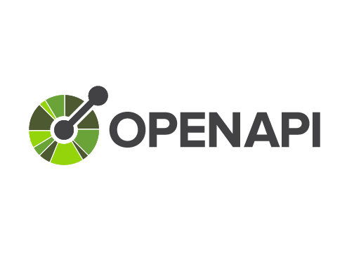

  
  <h1>Componentizer</h1>

  This is a GSoC 2023 project. Initial project is proposed at [Postman Open Technologies GSoC 2023](https://github.com/postman-open-technologies/gsoc-2023/issues/9)
  
**Mentoring organization:** [Postman](https://www.postman.com)

**Organizer:** [Postman Open Technologies](https://github.com/postman-open-technologies)

**Mentors:** [Bala Avulapati](https://github.com/bavulapati), [Darshan Sen](https://github.com/RaisinTen), [Arvind Kalra](https://github.com/arvindkalra08)

**OpenAPI Specification Lead:** [Mike Ralphson](https://github.com/MikeRalphson)

## Product Requirements
  What are the functions and features required?
- A Command Line Interface (**CLI**) tool and library taking one or more OpenAPI 3.x specifications in JSON or YAML (YAML is a superset of JSON so you can read JSON with any YAML parser) and producing the either one OpenAPI document with all the common [components](https://oai.github.io/Documentation/specification/components.html) moved to the `components` section (in the case of a single input file) or moved to a new common OAS document's `components` section (in the case of two or more input files).
- **Good to have requirement**: CLI's capability to accept the list of components to list under common components. This can be via CLI parameters.
- **Good to have requirement**: Capability to preserve comments in the components
- **Good to have requirement**: Capability to identify similar components and prompting user to confirm, before producing the output. The similarity detection can consider component description and other fields.

## Process Requirements
  How people interact with a product and how a product interacts with other (often existing) business processes?
- Users should be able to find the tool via online search, with an intention to improve and simplify the OpenAPI specification. This tool can sit next to the [existing tools](https://tools.openapis.org/) in the OpenAPI ecosystems.
- **Good to have**: While generating OpenAPI specification from code or collections on Postman, Postman should be able to use this tool to simplify the specification.
- **Tech Stack:** We are thinking about Typescript, Go or C++, as the team has people familiar with this but we will consider the comfort of the contributors.
- **Distribution**: How we distribute the tool depends on the tech stack we choose. We will revisit this when we decide the tech stack.

## Note about AI usage

The use of Artificial Intelligence is discouraged either in your contributions or proposal preparation, as it doesn’t help us learn at the early stage in the open source community. The contributors or applicants of GSoC can include a paragraph in their proposal, that it has been written without the help of AI.

## Contact

If you have any questions or queries, please [use github discussions](https://github.com/postman-open-technologies/openapi-componentizer/discussions) on this repo, start a topic on [our community forums in the GSoC category](https://community.postman.com/c/open-technology/gsoc/42) or send an email to us at gsoc@postman.com.

 
